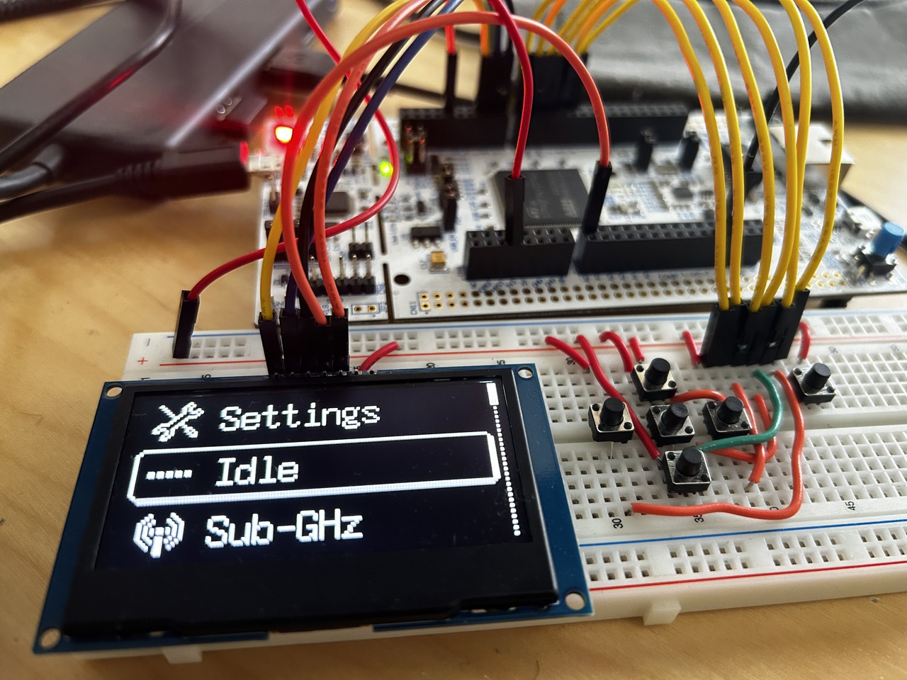

# SimpleGUI on STM32



# Idle Page Demo


### Challenges

Initially, in between each frame of the animation, I had to add a delay (HAL_Delay) to slow down the animation. Otherwise the animation would play at the speed the program runs at, which is too fast.
In the main while loop I have 3 lines:

```c
while (1)
{

    //USE FREE RTOS IN LATER IMPLEMENTATION
    handle_Windows(&u8g2);//Task1
    HAL_GPIO_TogglePin(LD2_GPIO_Port,LD2_Pin);//Task2
    HAL_Delay(10);

}
```

I have an onboard LED toggleing every 10ms. However having that delay in the idle screen animation causes the LED to blink at the same rate as the animation. This is not ideal it is blocking code. Instead, I used Timer 3 on the STM32 to generate an interrupt every 1ms (overflow interrupt), this way I can count the number of times the interrupt is triggered (i.e. count number of milliseconds), and in the interrupt handler increment the number of times it has been triggered AND also increment the animation frames once the number of milliseconds has reached 255ms (using uint8_t to count). This way the animation will play at about 4fps.

And how as the demo above shows, the animation plays without blocking the LED being toggled every 10ms.

```c
//z_iter is a uint8_t global variable
void window_Idle(u8g2_t* u8g2){
	button input = handleInput().direction;
	switch(input){
	case up:
		currWindow=menu;
		break;
	case down:
		currWindow=menu;
		break;
	case select:
		currWindow=menu;
		break;
	case back:
		currWindow=menu;
		break;
	case left:
		currWindow=menu;
		break;
	case right:
		currWindow=menu;
		break;
	case null:
		/*-------------------------*/
		break;
	}
	u8g2_ClearBuffer(u8g2);
	u8g2_SetDrawColor(u8g2,1);
	switch(z_iter){
	case 0:
		u8g2_DrawXBMP(u8g2, 20, 20, panda0_width, panda0_height,  panda0_bits);
		u8g2_SetFont(u8g2,u8g_font_5x8);
		u8g2_DrawStr(u8g2, 30, 35, "z");
		break;
	case 1:
		u8g2_DrawXBMP(u8g2, 20, 21, panda1_width, panda1_height,  panda1_bits);
		u8g2_SetFont(u8g2,u8g_font_7x14);
		u8g2_DrawStr(u8g2, 23, 27, "z");
		break;
	case 2:
		u8g2_DrawXBMP(u8g2, 20, 21, panda1_width, panda1_height,  panda1_bits);
		u8g2_SetFont(u8g2,u8g_font_7x14);
		u8g2_DrawStr(u8g2, 13, 15, "Z");
		break;
	case 3:
		u8g2_DrawXBMP(u8g2, 20, 20, panda0_width, panda0_height,  panda0_bits);
		u8g2_SetFont(u8g2,u8g_font_7x14);
		u8g2_DrawStr(u8g2, 13, 15, "Z");
	}
	u8g2_SendBuffer(u8g2);
	//Animation Delay is Handled in Tim3 PeriodElapsedCallback IRQ in main.c [User Code 4]
}

void HAL_TIM_PeriodElapsedCallback(TIM_HandleTypeDef *htim){
	if(htim == &htim3){
		if(Tim3Count==255){
			//Handle Idle Animation Delay
			z_iter++;
			z_iter=z_iter%4;
		}
		if(Tim3Count>=255){
			Tim3Count=0;//Don't let overflow
		}
		Tim3Count++;
	}
}
```
